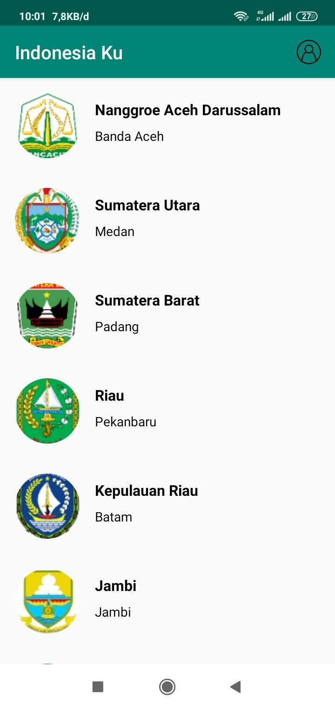
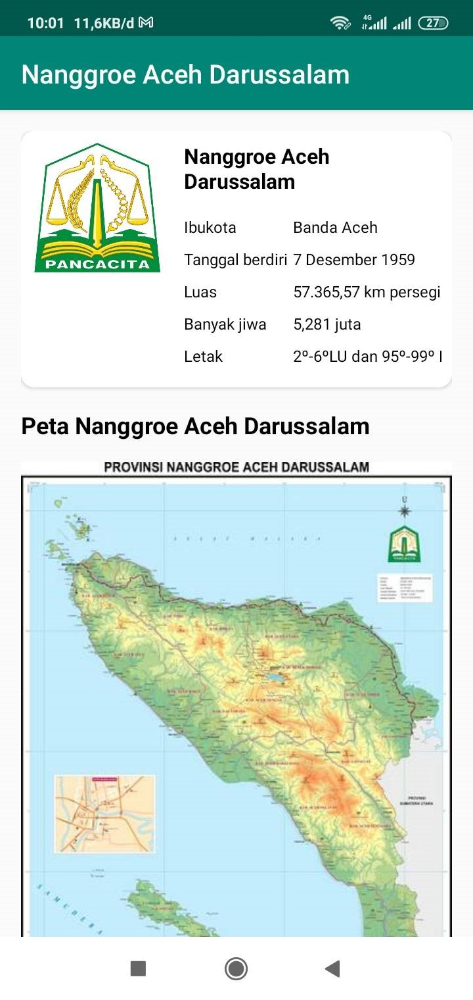
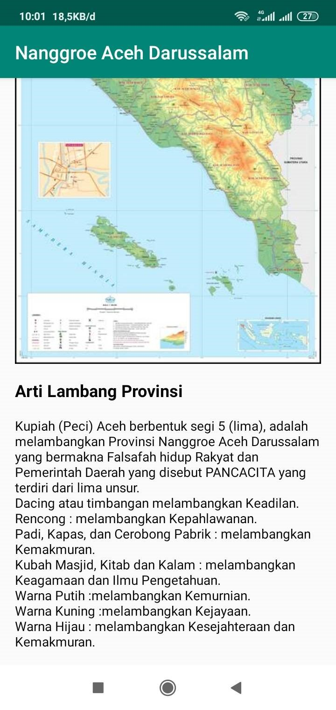

# IndonesiaKu
This is an Android App that implemented basic of android, like activity in android, activity : intent, view group,recyler view, and using of card view

This app is as a final project to complete my course "Belajar Membuat Aplikasi Android untuk Pemula" on Dicoding platform

## Screenshots

  
  
  

